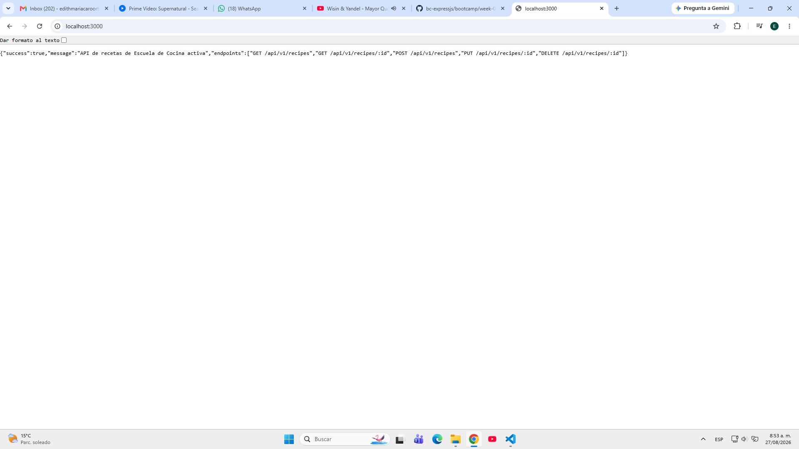
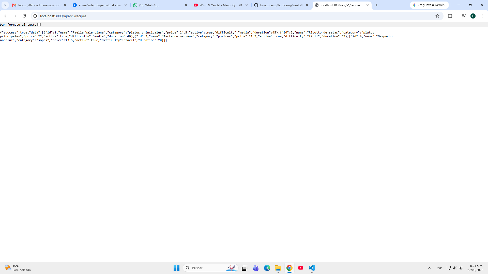
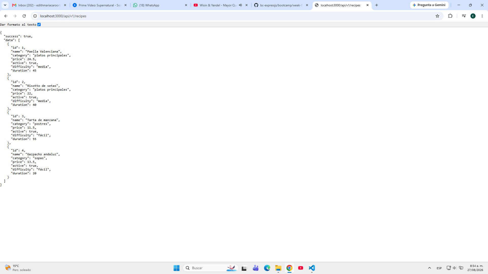
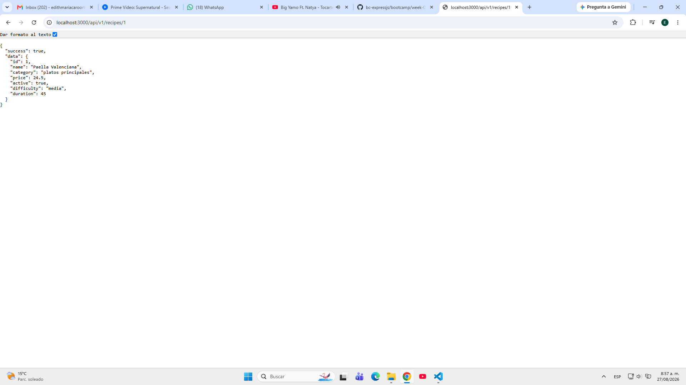

# Capturas de pantalla – Semana 2

Esta carpeta está preparada para guardar las evidencias visuales del proyecto.

## Capturas recomendadas

1. [captura-01-raiz.png](./captura-01-raiz.png) — `http://localhost:3000`
2. [captura-02-listar-recetas.png](./captura-02-listar-recetas.png) — `GET /api/v1/recipes`
3. [captura-03-crear-receta.png](./captura-03-crear-receta.png) — `POST /api/v1/recipes`
4. [captura-04-receta-por-id.png](./captura-04-receta-por-id.png) — `GET /api/v1/recipes/1`
5. [captura-05-actualizar-receta.png](./captura-05-actualizar-receta.png) — `PUT /api/v1/recipes/1`
6. [captura-06-eliminar-receta.jfif](./captura-06-eliminar-receta.jfif) — `DELETE /api/v1/recipes/1`
7. [captura-07-404.jfif](./captura-07-404.jfif) — ruta inexistente o recurso no encontrado

## Evidencias

## Instrucciones

- Guarda cada captura con el nombre indicado.
- Puedes usar formato `.png` o `.jpg`.
- Si quieres, puedes renombrarlas según tu criterio, pero mantén una nomenclatura clara.

## Ubicación de la documentación

La documentación complementaria está en:

- [docs/README.md](../docs/README.md)
