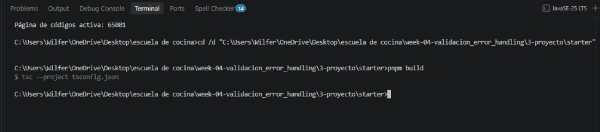
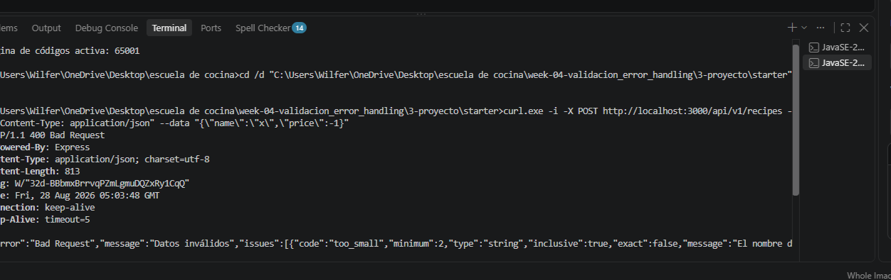
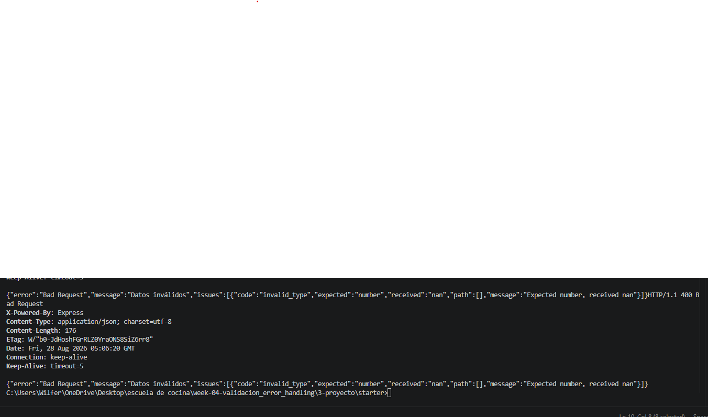
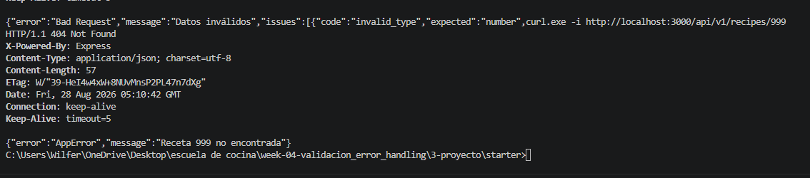
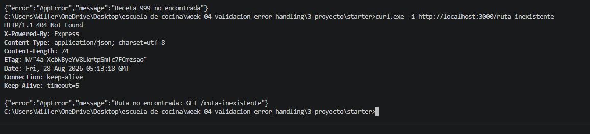
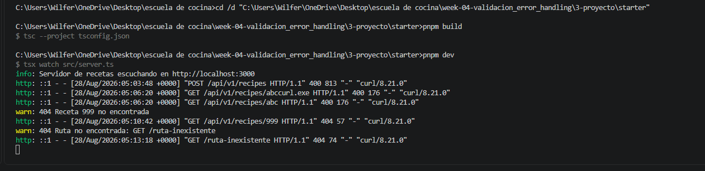

# Capturas de pantalla - Semana 4

Guarda aquí las evidencias de:

1. [build.png](./build.png) - `pnpm build` sin errores.
2. [-invalid-post.png](./-invalid-post.png) - `POST` inválido con respuesta `400` e `issues[]`.
3. [invalid-id.png](./invalid-id.png) - `GET /api/v1/recipes/abc` con respuesta `400`.
4. [missing-id.png](./missing-id.png) - `GET /api/v1/recipes/999` con respuesta `404`.
5. [missing-route.png](./missing-route.png) - `GET /ruta-inexistente` con JSON `404`.
6. [logs.png](./logs.png) - logs de Morgan/Winston visibles en la consola.

## Evidencias

