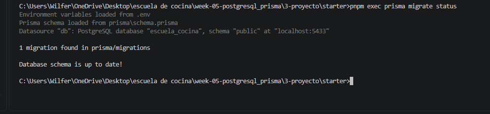
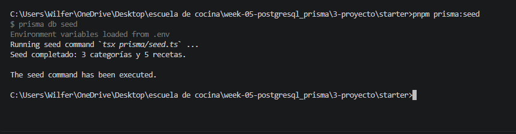
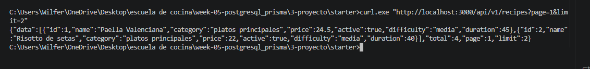
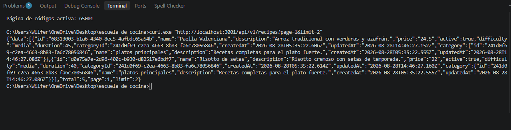
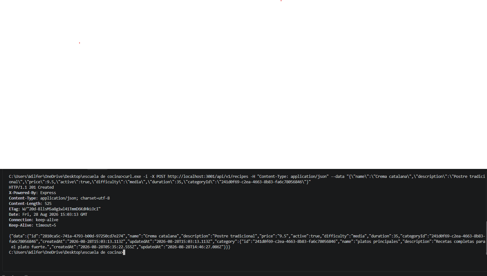
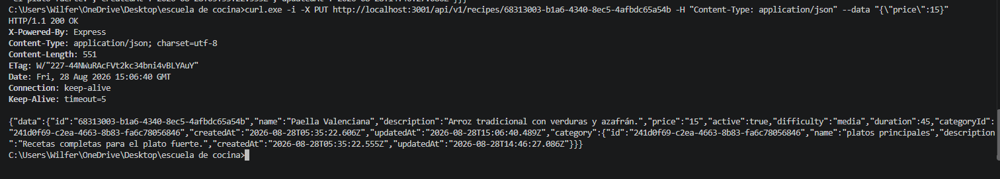
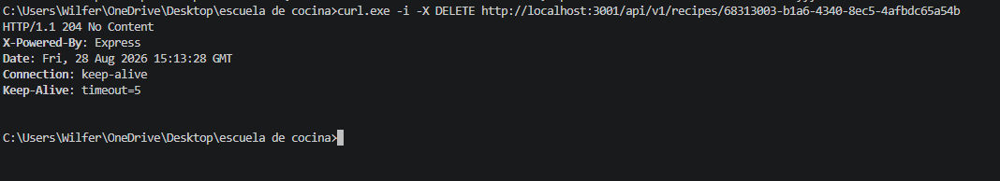
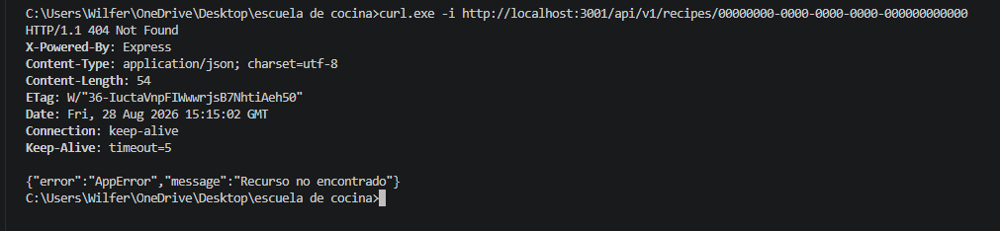
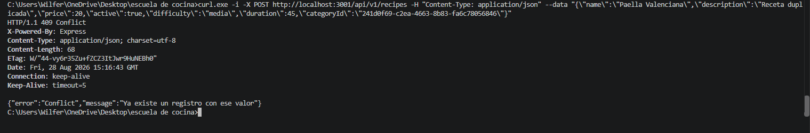

# Capturas de pantalla - Semana 5

Guarda aquí las evidencias de:

1. `01-migrate.png` - migración Prisma ejecutada.
2. `02-seed.png` - `pnpm prisma:seed` con 5 recetas y categorías.
3. [03-lista.png](./03-lista.png) - listado paginado.
4. `04-detalle.png` - detalle de receta con categoría relacionada.
5. `05-crear.png` - creación con respuesta `201`.
6. `06-actualizar.png` - actualización con respuesta `200`.
7. `07-eliminar.png` - eliminación con respuesta `204`.
8. `08-error-404.png` - recurso inexistente con respuesta `404`.
9. `09-error-409.png` - conflicto de valor único con respuesta `409`.

## Evidencias disponibles

