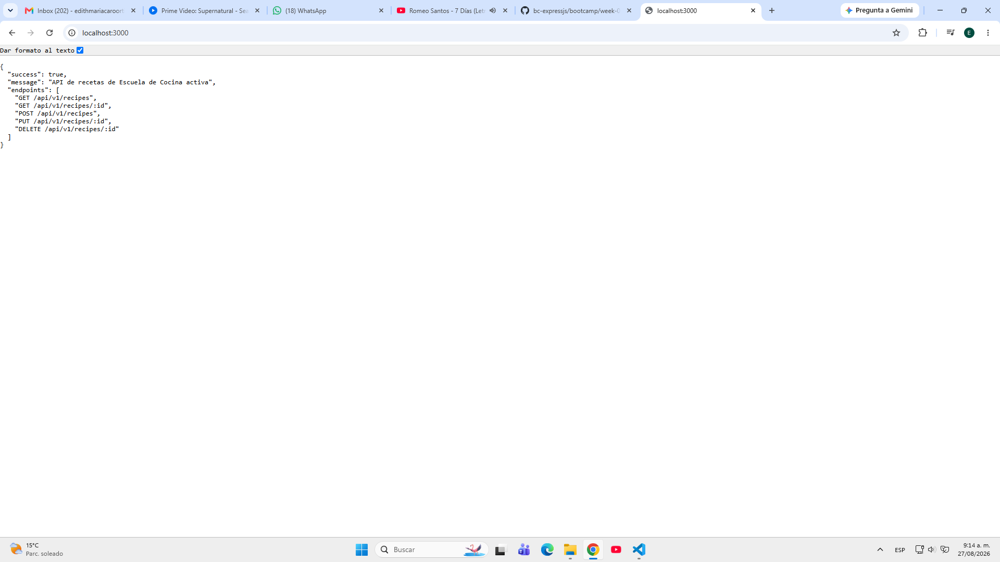
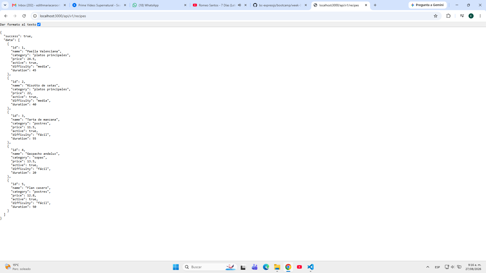
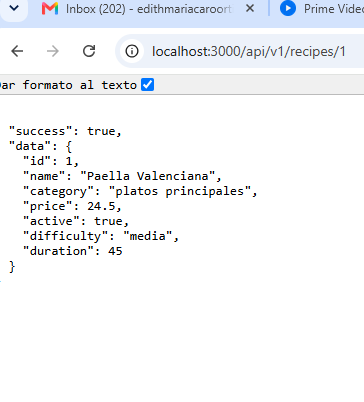

# Capturas de pantalla – Semana 3

Esta carpeta contiene las evidencias visuales del proyecto de la semana 3.

## 1) Compilación del proyecto

**Descripción:** captura de la terminal ejecutando `pnpm build`.

**Objetivo:** demostrar que el proyecto compila sin errores TypeScript.

---

## 2) Servidor levantado

**Descripción:** respuesta de `http://localhost:3000`.

**Objetivo:** mostrar que el servidor está funcionando y responde en la raíz.

---

## 3) Listado de recetas

**Descripción:** respuesta de `GET /api/v1/recipes`.

**Objetivo:** demostrar que el endpoint devuelve los datos del catálogo.

---

## 4) Crear receta

**Descripción:** respuesta de `POST /api/v1/recipes`.

**Objetivo:** demostrar que se crea un nuevo recurso correctamente.

---

## Nota

Estas imágenes deben guardarse en esta misma carpeta con los nombres exactos:

- `build.jfif`
- `raiz.png`
- `listado.png`
- `crear.png`

Cuando estén presentes, GitHub/VS Code mostrará automáticamente la vista previa en este README.
